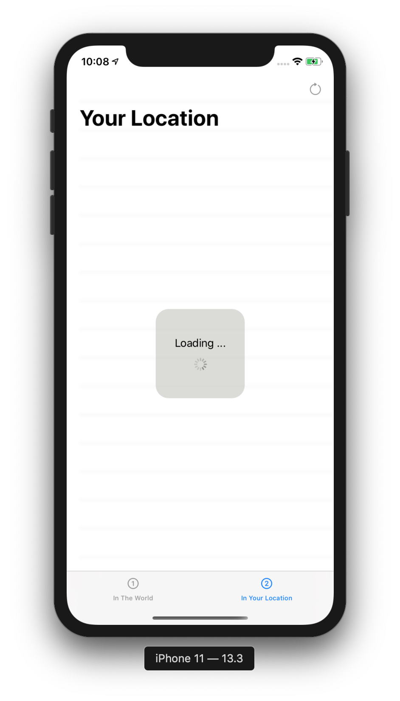

### LastEarthQuakesSwiftUI

The aim of this project is to show how to create a SwiftUI app that has network communication.

The API of [https://earthquake.usgs.gov/](https://earthquake.usgs.gov/fdsnws/event/1/#parameters) was used to list the earthquakes.

In the first tab you can see the latest earthquakes all over the world.

In the second tab you can see the earthquakes at your location.(Max Radius = 500km.)

## Screenshots

